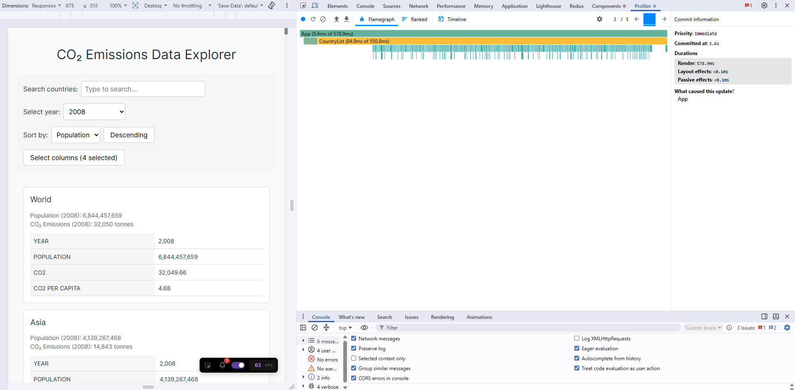
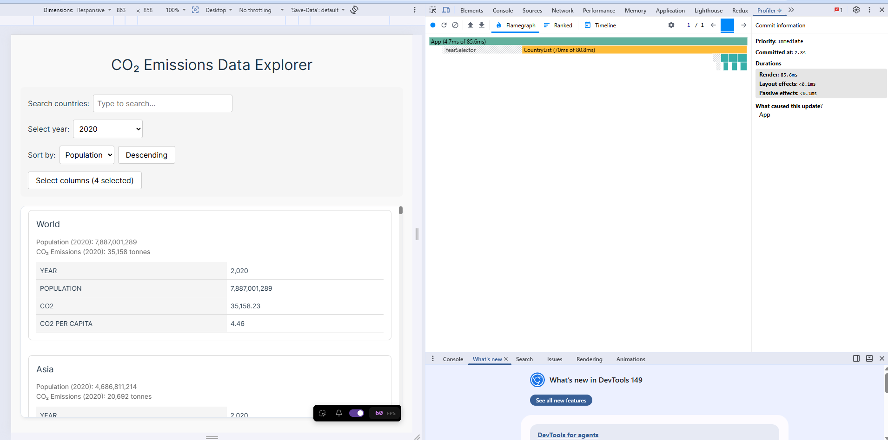
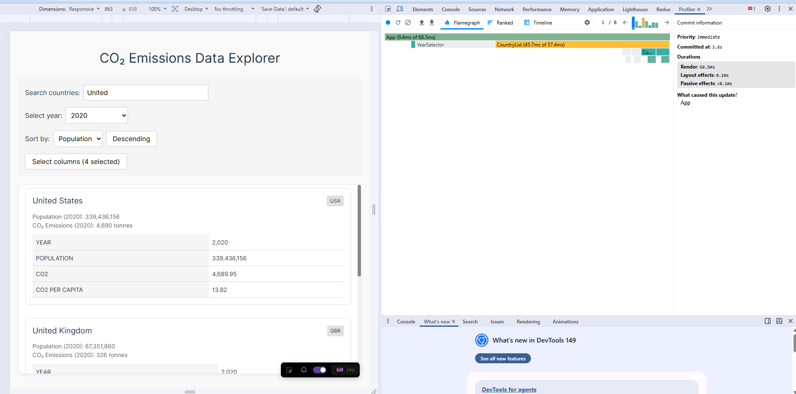
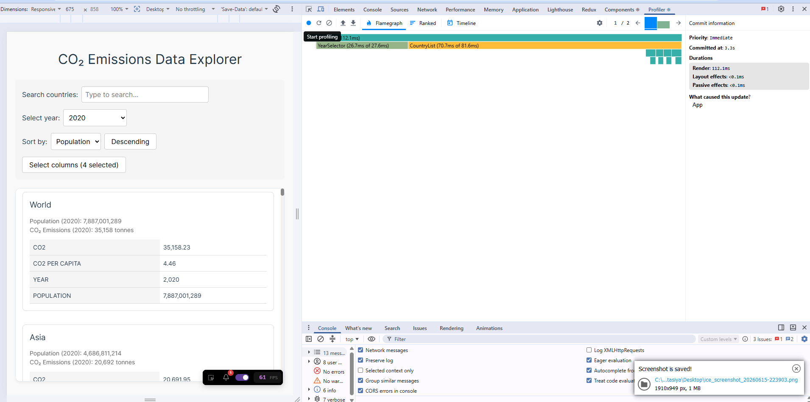
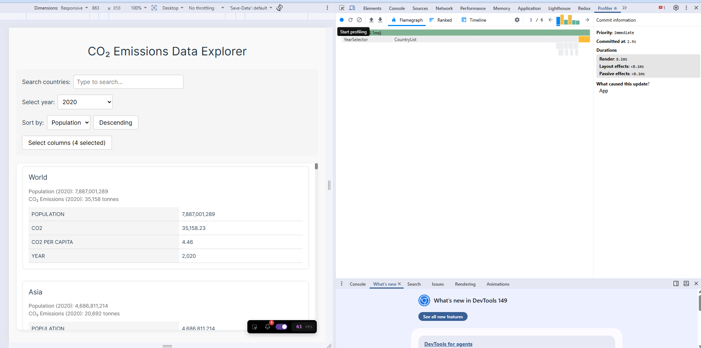

# Performance Optimization Report

## Baseline Measurements

### Interaction A: Sort countries

- **Commit duration**: 4.5 s
- **Render duration**: 578.3 ms
- **Screenshot**: 

### Interaction B: Search countries

- **Commit duration**: 2.8 s
- **Render duration**: 270.0 ms
- **Screenshot**: 

### Interaction C: Change year

- **Commit duration**: 3.6 s
- **Render duration**: 578.9 ms
- **Screenshot**: 

### Interaction D: Toggle column

- **Commit duration**: 1.7 s
- **Render duration**: 39.2 ms
- **Screenshot**: 

## Optimized Measurements

### Interaction A: Sort countries

- **Commit duration**: 2.8 s
- **Render duration**: 85.6 ms
- **Screenshot**: 

### Interaction B: Search countries

- **Commit duration**: 3.8 s
- **Render duration**: 68.5 ms
- **Screenshot**: 

### Interaction C: Change year

- **Commit duration**: 3.3s
- **Render duration**: 112.1 ms
- **Screenshot**: 

### Interaction D: Toggle column

- **Commit duration**: 2.9 s
- **Render duration**: 8.1 ms
- **Screenshot**: 

## Summary of Improvements

| Interaction      | Baseline (ms) | Optimized (ms) | Improvement |
| ---------------- | ------------- | -------------- | ----------- |
| Sort countries   | 578.3         | 85.6           | 85.20 %     |
| Search countries | 270.0         | 68.5           | 74.63 %     |
| Change year      | 578.9         | 112.1          | 80.64 %     |
| Toggle column    | 39.2          | 8.1            | 79.34 %     |
| **Average**      | **366.6**     | **68.6**       | **81.29 %** |

